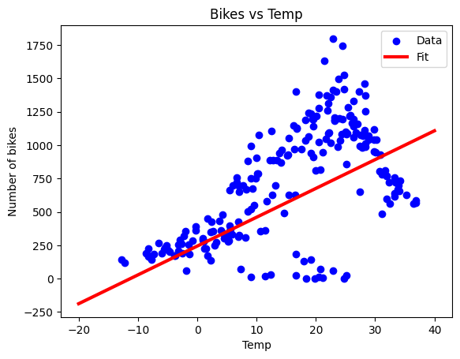
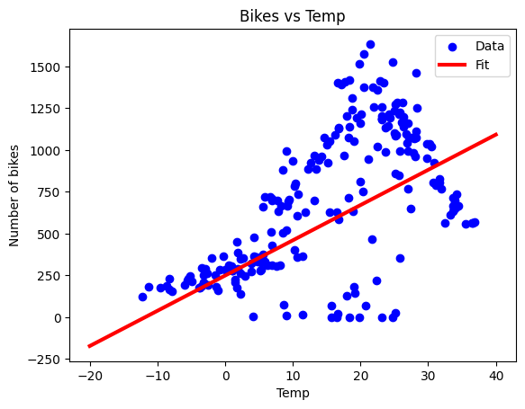
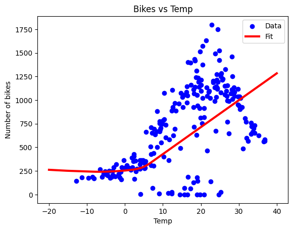
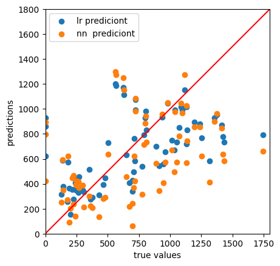

# My project about bikes renting in Seul

---

## Data

All data you can find under this link: https://archive.ics.uci.edu/dataset/560/seoul+bike+sharing+demand
The dataset contains count of public bicycles rented per hour in the Seoul Bike Sharing System, with corresponding weather data and holiday information.

## Project

To make this project I followed this tutorial: https://youtu.be/i_LwzRVP7bg?si=eSPFaogmH2-Sx2wM 
In this project I focused on learning linear regression. I used it, multiple linear regression, linear regression with neural network and pure neural network to anticipate the demand for bicycle rentals.

## Plots

### linear regression

### linear regresion with neural network

### neural network

### neural network vs linera regression in mse

## conclusions
This project helped me better understand linear regression better. In this case the best model is multiple linear regression, it is much better than linear regression or other modles. Last plot shows that linear regression has quite simmilar output to neural network, but still it mse is 127058.3213144134, and neural network mse is 172833.02859235142.

